# Online Shopping Mobile Application

## Project Title

**Big V SuperMarket Mobile Shopping Application**

## Student Information

**Course:** IS223 Object-Oriented Programming  
**Institution:** Papua New Guinea University of Technology

### Group Members

- **Joseph SEETO**
- Micheal FAN
- Theodorah ROY
- Dasha TELIKADAH

---

## Project Description

This project is a mobile shopping application developed for **BIG V SuperMarket**, located in Lae Toptown, Morobe Province.

BIG V SuperMarket sells a variety of products across several categories, including groceries, fresh produce, fresh meat, fashion/clothing, liquor, electronics, bakery products, and household items.

For this project, our group selected four main product categories:

- Groceries
- Electronics
- Clothing
- Household

These categories were selected because they represent commonly purchased products among supermarket customers.

The application is currently an **academic prototype** designed to demonstrate how customers could browse and shop for supermarket products using a mobile phone instead of physically visiting the store.

Customers can browse products, view product details, add products to a shopping cart, manage quantities, calculate totals, enter delivery information, and complete a simulated checkout process.

> **Note:** The checkout system is an academic prototype only. It does not process real financial transactions, bank payments, or credit cards.

---

## Application Objectives

The objectives of the application are to:

- **Analyse Requirements:** Analyse the requirements of an online shopping application.
- **Business Context:** Identify a suitable business context for the application.
- **Interface Design:** Design an appropriate mobile application interface.
- **Apply Java OOP Principles:** Apply Java object-oriented programming principles in the development of the application.
- **Classes & Objects:** Implement classes and objects to represent products, customers, shopping carts, and orders.
- **Constructors & Methods:** Apply constructors and methods to initialise and manipulate application objects.
- **Inheritance:** Demonstrate inheritance using appropriate parent and child classes.
- **Method Overriding:** Demonstrate method overriding where appropriate.
- **Polymorphism:** Apply polymorphism within the application.
- **Shopping Cart:** Implement a functional shopping cart.
- **Calculations:** Calculate product subtotals and the overall shopping total.
- **Android UI:** Develop an Android graphical user interface using XML layouts.
- **Event Handling:** Implement event handling using Java.
- **Testing:** Test the application and identify programming or usability errors.
- **Documentation:** Document the design, implementation, testing, and evaluation of the application.

---

## Development Tools

| Tool / Technology | Purpose |
| --- | --- |
| **Android Studio** | Primary Integrated Development Environment (IDE) for Android application development |
| **Java (JDK)** | Core programming language used for application logic and OOP implementation |
| **Android SDK** | Provides Android development libraries and framework APIs |
| **Android XML** | Used to design the application's mobile user interface layouts |
| **Android Virtual Device (AVD) / Physical Device** | Testing environment for running and validating the mobile application |
| **Git & GitHub** | Version control and source-code repository management |

---

## Main Features

### Core Functional Features

- **Welcome & Splash Screen:** Displays the application logo, business name, and initial welcome branding.
- **Home Screen:** Provides quick navigation to products, categories, and the shopping cart.
- **Product Categories:** Allows users to browse products organised into Grocery, Electronics, Clothing, and Household categories.
- **Product List & Details:** Displays product names, prices, category information, images, and additional product details.
- **Product Selection & Cart Management:** Allows users to select products, add them to the shopping cart, manage quantities, and view subtotals.
- **Automated Total Calculation:** Automatically calculates and updates the total cost of selected products.
- **Simulated Checkout:** Collects customer details such as name, phone number, and delivery location alongside an order summary.
- **Order Confirmation:** Displays a confirmation message and order summary after the prototype checkout process is completed.

### Additional Features

- **OOP Product System:** Uses parent and subclass structures to organise different product types.
- **Cart Management:** Allows users to add and remove products and calculate the total cost.
- **Persistent Shopping Cart:** Keeps cart items available while users navigate between different application screens.
- **Category Filtering:** Allows users to browse Grocery, Electronics, Clothing, and Household products by category.
- **Product Catalogue:** Displays products with images, categories, and Papua New Guinea Kina (K) prices.
- **Product Details:** Shows detailed product information with an **Add to Cart** option.
- **Shopping Cart Screen:** Displays selected products, quantities, prices, subtotals, and the total cost.
- **Checkout System:** Collects and validates customer and delivery information.
- **Order Confirmation:** Displays a successful order summary after checkout.
- **23 Integrated Products:** Includes 23 supermarket products with high-resolution images.
- **PNG Local Pricing:** Uses realistic Papua New Guinea Kina (K) prices.
- **GitHub Version Control:** Uses GitHub with organised and descriptive commits.
- **Project Documentation:** Includes a README and supporting project documentation covering the application's structure and development.

---

## OOP Concepts Demonstrated

- **Classes & Objects:** Uses `Product`, `Grocery`, `Electronics`, `Clothing`, `Household`, `Customer`, `Cart`, and `Order` classes, with objects instantiated throughout the application.
- **Encapsulation:** Uses private fields with public getters and setters across application classes.
- **Constructors:** Uses constructors, including constructor overloading and constructor chaining.
- **Inheritance:** `Grocery`, `Electronics`, `Clothing`, and `Household` extend the `Product` parent class.
- **Method Overriding:** Each product subclass overrides `displayProduct()` with category-specific behaviour.
- **Polymorphism:** A single `List<Product>` can store objects from different product subclasses, allowing the appropriate overridden methods to be called at runtime.
- **Abstraction:** `Product` provides a general structure for product information and behaviour while subclasses provide their own specialised implementations.
- **Interfaces:** Android's `View.OnClickListener` interface is used for button event handling.
- **Composition:** `Order` contains `Customer` and `Cart` objects, representing a "has-a" relationship.
- **Collections (ArrayList):** `ArrayList<Product>` is used to manage the shopping cart and product catalogue.
- **Event Handling:** Button click listeners connect Java application logic with the XML user interface.

---

## Installation Instructions

Follow these steps to clone, set up, and run the application.

### Prerequisites

Before running the project, ensure you have:

- **Android Studio** — a recent compatible version
- **Java Development Kit (JDK 11 or 17)**
- **Git** installed on your computer
- An **Android emulator** or compatible physical Android device

---

### Step 1: Clone the Repository

Open Terminal, Git Bash, or Command Prompt and run:

```bash
git clone https://github.com/kawcii/online-shopping-app.git
```

Then navigate into the project directory:

```bash
cd online-shopping-app
```

---

### Step 2: Open the Project in Android Studio

1. Launch **Android Studio**.
2. Select **File > Open** or select **Open** from the Welcome screen.
3. Locate and select the cloned `online-shopping-app` project directory.
4. Click **OK** to open the project.

---

### Step 3: Build and Sync the Project

1. Allow Android Studio to complete the **Gradle Build and Sync** process.
2. If Android Studio displays a **Sync Now** option, click it.
3. Wait until the project finishes building before running the application.

---

### Step 4: Set Up an Android Emulator or Physical Device

#### Using an Android Emulator

1. Open **Tools > Device Manager**.
2. Select **Create Device**.
3. Choose an Android device profile.
4. Select an appropriate Android system image.
5. Complete the setup and start the emulator.

#### Using a Physical Android Device

1. Enable **Developer Options** on the Android device.
2. Enable **USB Debugging**.
3. Connect the device to the computer using a USB cable.
4. Allow USB debugging access if prompted on the device.

---

### Step 5: Run the Application

1. Select the active emulator or connected Android device from the Android Studio device menu.
2. Click the green **Run** button or press **Shift + F10**.
3. Android Studio will build the application and install it on the selected device.
4. The **Splash / Welcome Screen** should appear when the application starts.

---

## Repository Verification Before Submission

Before submitting the GitHub repository link, perform the following checks:

1. **Push the latest project files to GitHub.**
    - Ensure the latest Java source files are included.
    - Ensure XML layouts and application resources are included.
    - Ensure product images and other required assets are included.

2. **Verify important project directories**, including:

```text
app/src/main/java/
app/src/main/res/
```

3. **Test the repository by cloning it into a new folder:**

```bash
git clone https://github.com/kawcii/online-shopping-app.git
```

4. Navigate into the cloned repository:

```bash
cd online-shopping-app
```

5. Open the newly cloned copy in Android Studio.

6. Allow Gradle to sync and build the project.

7. Run the application on an emulator or physical Android device.

8. Verify that the major features work correctly:
    - Splash / Welcome Screen
    - Home Screen
    - Product Catalogue
    - Category Filtering
    - Product Details
    - Add to Cart
    - Cart Management
    - Total Calculation
    - Checkout
    - Order Confirmation

If the newly cloned project builds and runs correctly, the repository is ready for submission.


## Screenshots

### Splash Screen


### Welcome Screen ("Welcome to BIG V!" + Enter Shop)

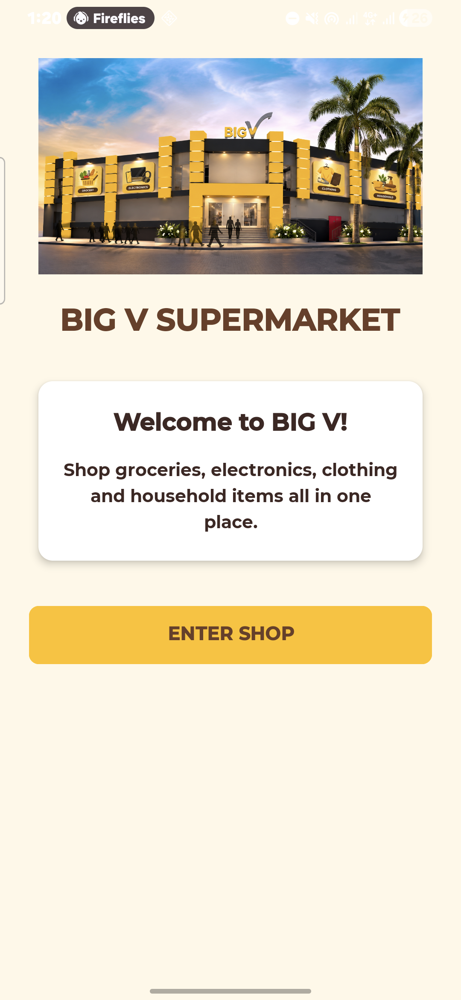

### Home Screen (View Products / Categories / Shopping Cart buttons)

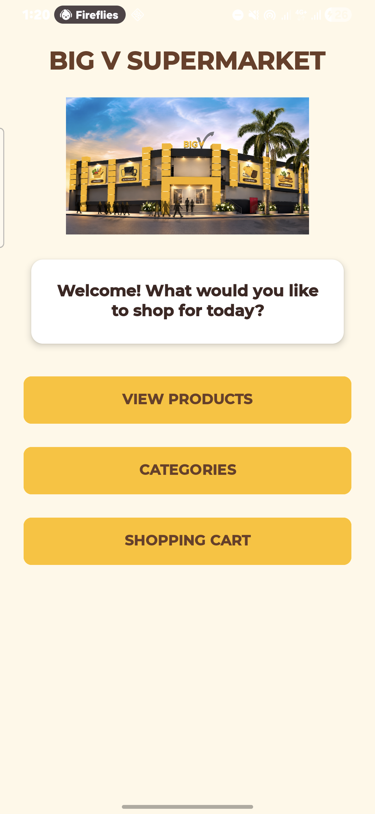

### Categories Screen (Shop by Category)

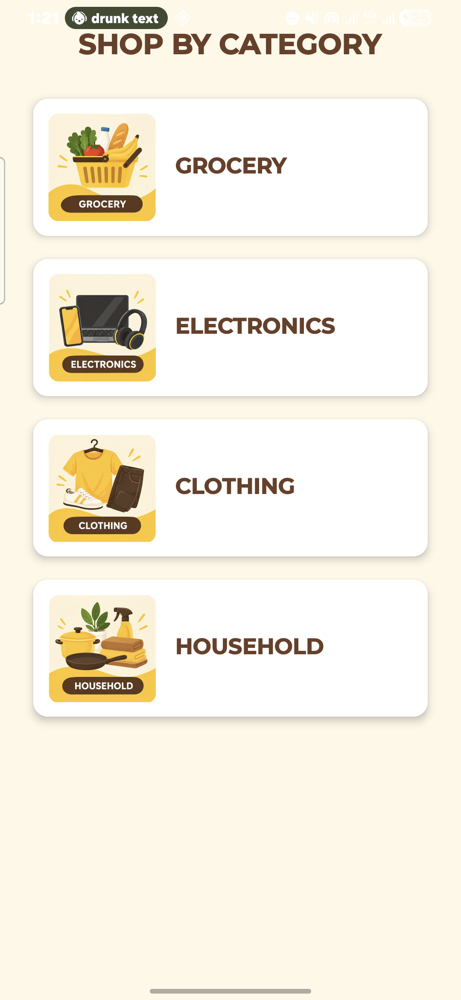

### Product List — All Products ("OUR PRODUCTS")

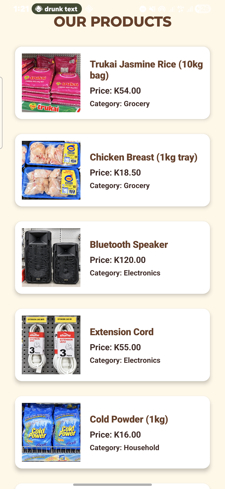

### Product List — Grocery (filtered)

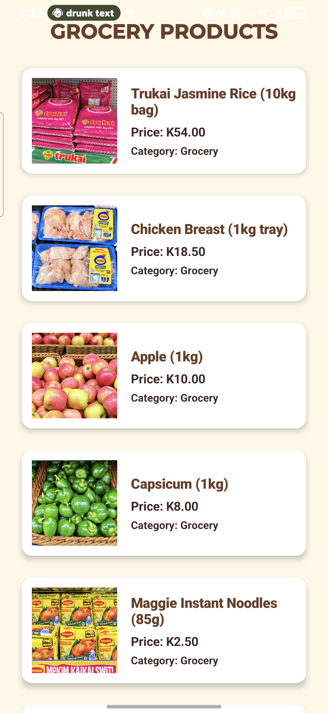

### Product List — Electronics (filtered)

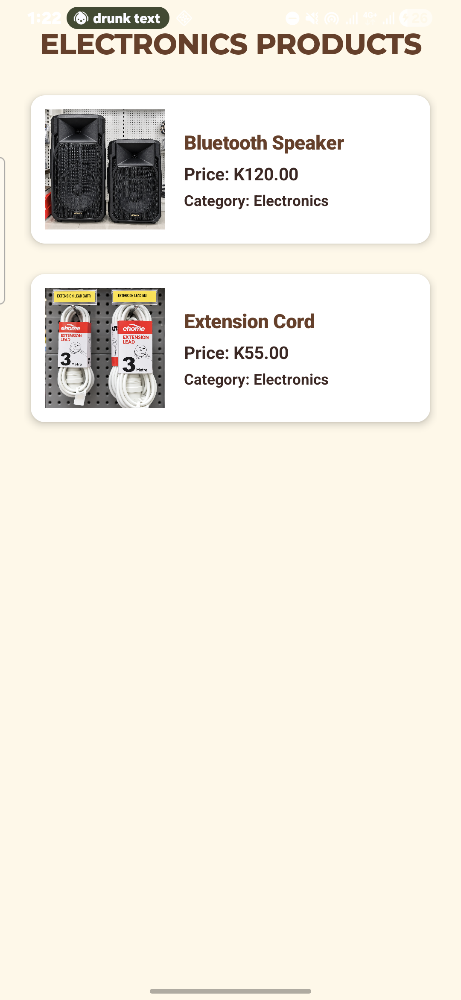

### Product List — Apparel & Footwear (filtered)

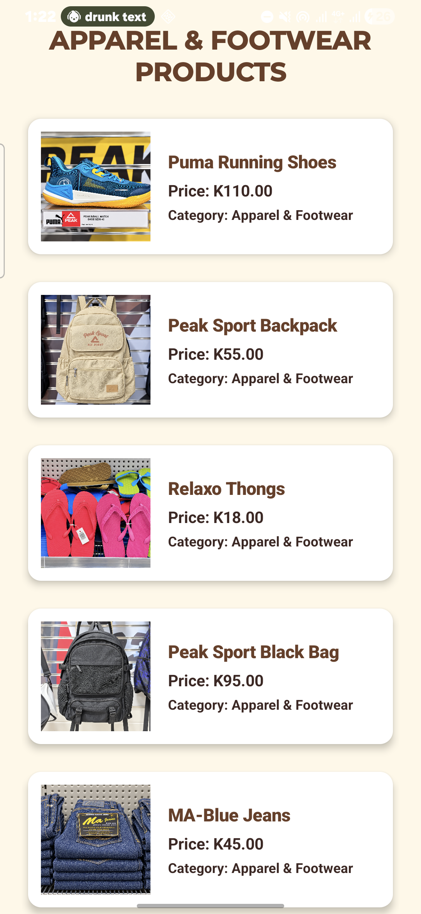

### Product List — Household (filtered)

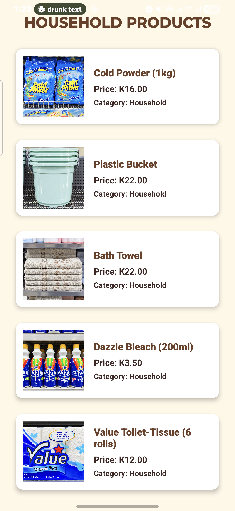

### Shopping Cart — empty

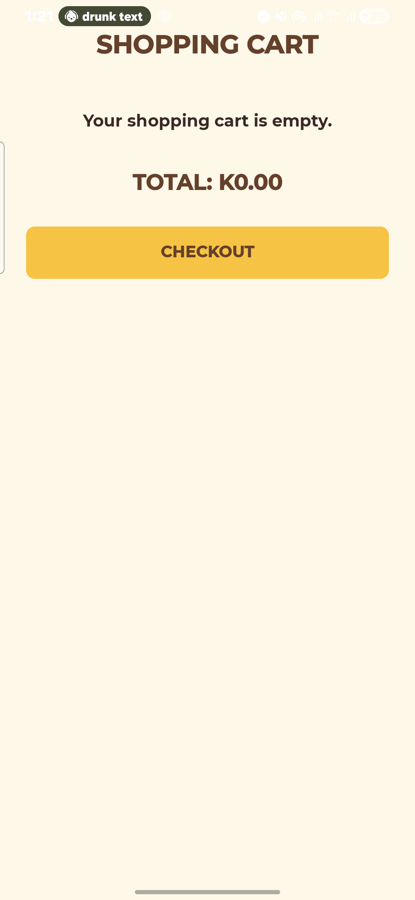

### Shopping Cart — with items

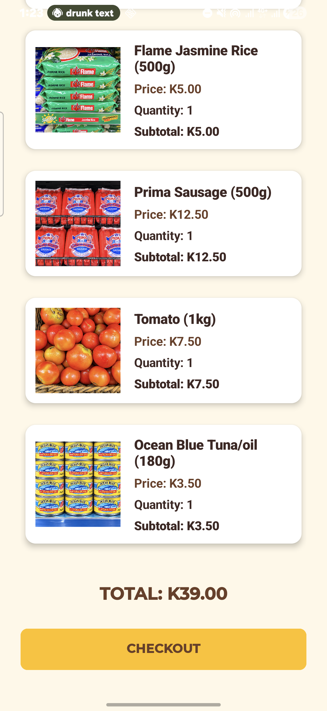

### Checkout

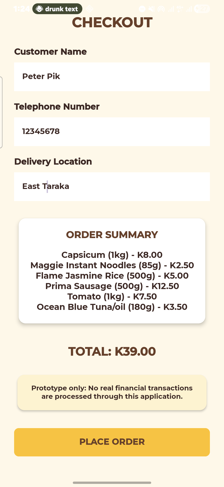

### Order Confirmation

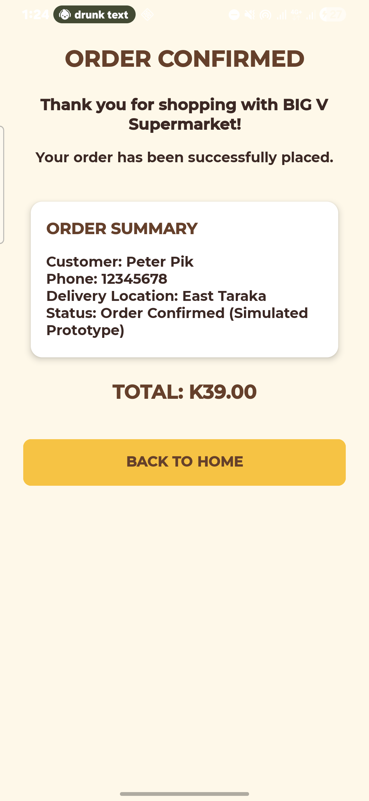
